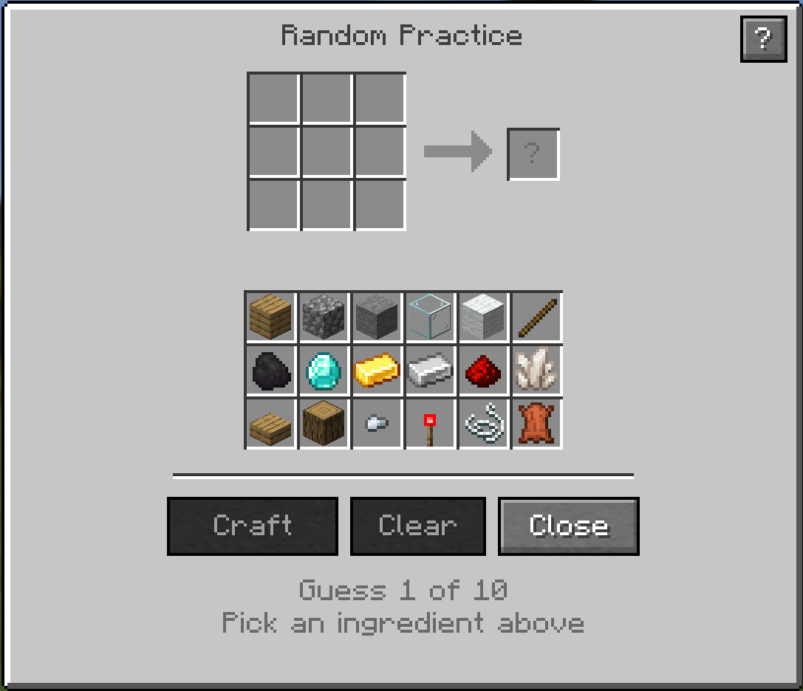
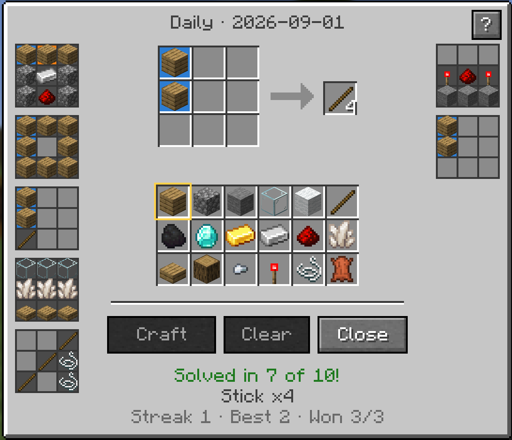

# Craftle

The daily crafting-recipe guessing game — in the game. A Fabric mod for Minecraft 26.2
that recreates the web game [Minecraftle](https://minecraftle.zachmanson.com) (by Zach
Manson and friends) as a native in-game screen.

Every day, everyone gets the same secret crafting recipe. You have **10 guesses** to
figure it out: place ingredients from a fixed 18-item palette into a 3×3 crafting grid
and press **Craft**. Each cell of your guess is graded Wordle-style:

- 🟩 **Green** — right ingredient, right cell
- 🟧 **Orange** — the ingredient is in the recipe, but belongs in a different cell
- ⬜ **Grey** — the ingredient is not in the recipe (or all its copies are accounted for)

Your previous guesses stay on screen as mini grids flanking the board — up to nine of
them — so you can cross-reference while you work. Solve it and the server announces your
win in chat; burn all ten guesses and it announces that too.

## Screenshots





## Commands

| Command | What it does |
|---|---|
| `/craftle` | Opens today's daily puzzle (or your finished board, once done) |
| `/craftle random` | Endless practice mode — resumes your current practice puzzle |
| `/craftle random new` | Abandons the current practice puzzle and starts a fresh one |

## How it works

- **Global daily.** The daily puzzle is picked deterministically from the UTC calendar
  day, so every server running the same game version shares the same puzzle. It resets
  at midnight UTC.
- **Server-authoritative.** The server holds the secret recipe and only ever sends your
  per-cell feedback — the answer never reaches the client until the game is over, so
  it can't be sniffed.
- **Recipe pool.** 127 vanilla shaped recipes — every one that can be built entirely
  from the ingredient palette. The list is fixed in the mod rather than read from
  whatever recipes a server has loaded, so a datapack or mod cannot shift the pool and
  hand that server a different daily. Recipes smaller than 3×3 are anchored to the
  top-left of the grid.
- **Dealt, not drawn.** The pool is shuffled and handed out one per day until it is
  exhausted, then reshuffled for the next pass. Every puzzle appears exactly once per
  127-day cycle, never two days running, and each cycle deals in its own order.
- **Stats.** Daily games track played/won, current streak, and best streak, shown on
  the board when you finish. Practice games don't touch your stats — and the practice
  picker never deals today's daily answer, so it can't spoil it (a practice puzzle that
  *becomes* the daily overnight is swapped out automatically).
- **Ingredient tracking.** The palette carries the same colours as the board: an
  ingredient turns green once it has landed in the right cell, orange while it is known
  to be in the recipe somewhere, and grey once it has been ruled out.
- **Persistence.** Games and stats live in the world save; you can log out mid-puzzle
  and pick up where you left off.

## Install

Both **client and server** need the mod (plus [Fabric API](https://www.curseforge.com/minecraft/mc-mods/fabric-api)):

1. Install the [Fabric loader](https://fabricmc.net/use/) for Minecraft 26.2.
2. Drop `craftle-<version>+mc26.2.jar` and the Fabric API jar into `mods/`.
3. In singleplayer it just works; on a server, install it on both sides.

Players without the mod on their client can't open the board — the command tells them
what's missing; nothing breaks for them otherwise.

## Building

```
./gradlew build
```

The jar lands in `build/libs/`. `./gradlew test` runs the game-logic unit tests
(guess evaluation, duplicate handling, daily determinism).

## Credits

Game concept and rules from the original web game
[Minecraftle](https://minecraftle.zachmanson.com) by Tamura Boog, Zach Manson,
Harrison Oates, and Ivan Sossa Gongora. This mod is an independent fan recreation for
in-game play.
